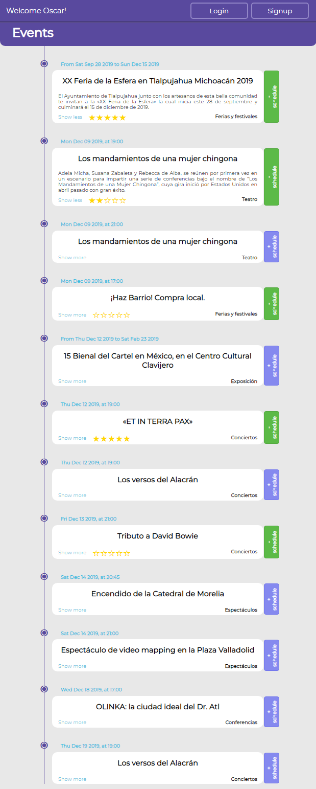

# Events calendar

This project consists of an app to publish a calendar of events to follow in my hometown, [Morelia](https://en.wikipedia.org/wiki/Morelia), in the state of [Michoacán, México](https://en.wikipedia.org/wiki/Michoac%C3%A1n).

The events are listed by date, and if the user signs/logs in, the system will keep record of the events added to the user's schedule, and the user will be able to rate the event.

## Built with:
- Ruby / Rails
- Javascript / React / Redux
- Lots of coffee...

## Live demo:
  * [Events calendar](https://oscarnava.github.io/Events-calendar/)
  * [Responsiveness test](http://ami.responsivedesign.is/?url=https%3A%2F%2Foscarnava.github.io%2FEvents-calendar%2F#)

## Getting Started

### Prerequisites
- Ruby: Check [this link](https://www.ruby-lang.org/en/documentation/installation/) if you need to install it.
- Rails: Check [this link](https://guides.rubyonrails.org/getting_started.html) if you need to install it.
- Node.js: Check [this link](https://nodejs.org/es/) if you need to install it.
- PostgreSQL: Check [this link](https://www.postgresql.org/download/) if you need to install it.

### Setup
> _**Important note :**_ Since the big aim of this project was to showcase the use of an API to implement communication between a web application's backend and frontend, both these parts are independent applications in the sense that they can reside in different servers.
>
>So, having said that, be aware that by installing the backend you are _**NOT**_ automatically enabling the frontend; you can install them in one single server, or two different servers, but they must be both installed independently. Notice how, for example, the Live demo frontend is served from GitHub pages and the backend from Heroku.
>
> **Apart from the API requests, one application knows nothing about the other.**

You can start by cloning this repository in your local storage. You will notice there are two folders named _**backend**_ and _**frontend**_. Please refer to the specific README inside each folder for further instructions on setting it up.

### Deployment
Since this is a rather unusual way of organizing a repository, please check this article on [**Deploying Rails API and React App to Heroku from a single GitHub repo**](https://medium.com/@nothingisfunny/deploying-rails-api-and-react-app-to-heroku-from-a-single-github-repo-7d8597abc55a), or if you prefer you can just [**split the subfolders out into a new repository**](https://help.github.com/en/github/using-git/splitting-a-subfolder-out-into-a-new-repository).

Again, please refer to the specific README inside each folder for further instructions.

### Author
  👤 Oscar Nava Trujillo
  - Github: [@oscarnava]( https://github.com/oscarnava )
  - Linkedin: [Oscar Nava Trujillo](https://www.linkedin.com/in/oscar-nava-trujillo-15847a14a/)

### To-do's
##### Backend

- [ ] Admin panel to create, update and remove events.

- [ ] **Important!** User email validation. (I'm sick of receiving unwanted emails from unverified services; I don't want others to suffer this because of me).

##### Frontend
- [ ] Possibility to filter the events list to show only the logged user scheduled events.
- [ ] Prevent rating the event before it takes place.
- [ ] Display a divider between events for different days, to aid the user on locating the day's event.

### Contributing
📦 Contributions, issues and feature requests are welcome!

Feel free to check the [issues page](https://github.com/oscarnava/Events-calendar/issues).

### Credits
Design idea by [Ibrahim Shaqura on Behance](https://www.behance.net/ibshaqura)

### License
Creative Commons [Attribution 4.0 International (CC BY 4.0)](https://creativecommons.org/licenses/by/4.0/)
